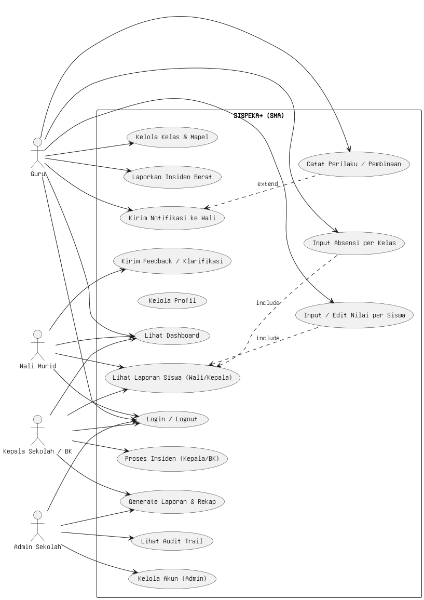
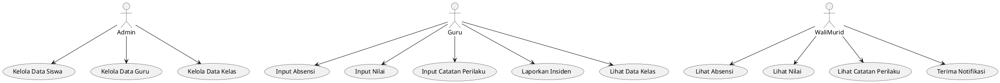
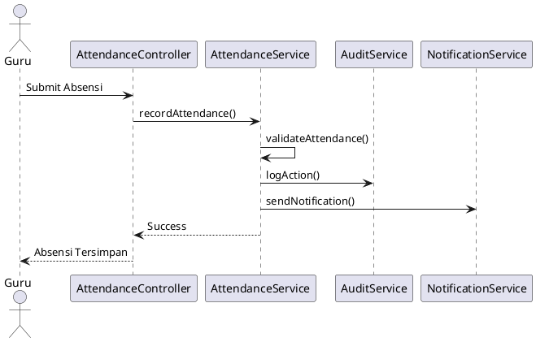
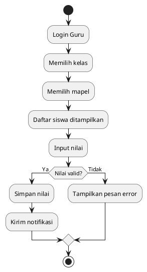
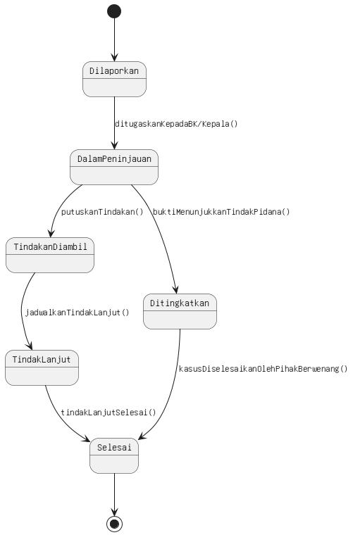
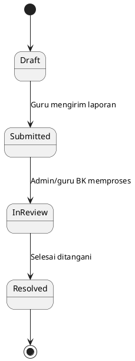

# SISPeka – Sistem Informasi Monitoring Siswa

# Dokumentasi Sistem (Draft)

**LAPORAN RANCANGAN SISTEM**
SISPEKA+ (Sistem Informasi Pengawasan & Evaluasi Karakter dan Akademik Siswa SMA)
*Disusun Oleh:*
Muhamad Ikbal Nurpadila (23010220007)
Naila Sapitri ( )

**Abstrak:**
SISPEKA+ merupakan sistem informasi berbasis web yang dirancang untuk meningkatkan transparansi dan kolaborasi antara guru, wali murid, serta pihak sekolah dalam pemantauan akademik dan perilaku siswa. Sistem ini berfungsi sebagai media pencatatan absensi, nilai, dan catatan karakter siswa yang dapat diakses secara real-time oleh wali murid. Melalui pendekatan Object-Oriented Design (OOD), sistem ini dibangun dengan struktur modular yang mendukung maintainability, scalability, dan reusability. Dengan implementasi pola desain seperti Factory Method, Builder, dan Singleton, sistem ini dapat dikembangkan lebih lanjut untuk mendukung analisis perilaku siswa dan sistem rekomendasi pembinaan.

**Pendahuluan & Latar Belakang**
Pendidikan merupakan pilar utama dalam pembentukan karakter bangsa. Namun, dalam praktiknya, sering muncul permasalahan antara guru, siswa, dan wali murid akibat kurangnya transparansi terhadap proses pembelajaran dan pembinaan karakter siswa.
Kasus seperti laporan wali murid terhadap guru karena tindakan disiplin, atau siswa yang mendapatkan perlakuan tanpa dokumentasi yang jelas, menunjukkan adanya celah komunikasi antara pihak sekolah dan keluarga.
Selain itu, guru di tingkat SMA biasanya mengajar di beberapa kelas dan mata pelajaran berbeda, dengan beban administrasi tinggi seperti input absensi dan nilai secara manual. Kondisi ini meningkatkan risiko kesalahan, kehilangan data, dan keterlambatan pelaporan.
Melihat permasalahan tersebut, diperlukan sebuah sistem yang:
Menyediakan transparansi antara pihak sekolah dan wali murid,
Mencatat kegiatan akademik dan perilaku siswa secara terpusat,
Mempermudah guru dalam mengelola kelas dan penilaian,
Menyediakan laporan karakter dan akademik yang terintegrasi.
Oleh karena itu, dibangunlah SISPEKA+, sistem berbasis web yang menjadi solusi modern untuk memantau perkembangan siswa dari dua sisi — akademik dan karakter — secara real-time.

**Rumusan Masalah**
Bagaimana merancang sistem yang dapat memfasilitasi guru dalam mengelola absensi, nilai, dan perilaku siswa di berbagai kelas secara efisien?
Bagaimana menyediakan akses yang transparan bagi wali murid terhadap perkembangan anaknya di sekolah?
Bagaimana mendokumentasikan tindakan pembinaan guru agar terhindar dari kesalahpahaman dengan wali murid?
Bagaimana merancang sistem yang fleksibel, mudah diperluas, dan dapat dipelihara secara berkelanjutan?

T**Tujuan**
Tujuan dari pembangunan SISPEKA+ adalah:
Meningkatkan efisiensi administrasi akademik dan pembinaan karakter siswa.
Memperkuat komunikasi antara sekolah dan wali murid.
Menyediakan data yang akurat dan mudah diakses untuk keperluan evaluasi siswa.
Mendukung akuntabilitas guru dan sekolah dalam proses pendidikan.
Menyediakan sistem yang modular dan siap dikembangkan lebih lanjut (misalnya sistem rekomendasi perilaku atau integrasi ke Dapodik).

**Analisis Kebutuhan**

*Kebutuhan Fungsional*
Login dan autentikasi berdasarkan peran (Admin, Guru, Wali Murid).
Manajemen data siswa, guru, kelas, dan mata pelajaran.
Pengelolaan absensi siswa per kelas dan per pertemuan.
Input dan pengelolaan nilai siswa berdasarkan mata pelajaran.
Catatan perilaku (positif dan negatif) yang terdokumentasi oleh guru.
Notifikasi otomatis kepada wali murid bila ada catatan perilaku atau absensi bermasalah.
Laporan perkembangan siswa (akademik + karakter).
Dashboard kepala sekolah/BK untuk melihat tren perilaku dan nilai.

*Kebutuhan Non-Fungsional*
Keamanan: Password di-hash, role-based access control.
Kinerja: Waktu respon < 3 detik untuk tiap request umum.
Reliabilitas: Backup otomatis setiap minggu.
Maintainability: Menggunakan arsitektur Service Layer dan Dependency Injection.
Scalability: Modular, dapat dikembangkan dengan microservice atau API.


**Desain Sistem**

*Desain Konseptual*
Sistem dibangun dengan pendekatan Object-Oriented Design (OOD) yang terdiri dari objek utama seperti:
User, Guru, Siswa, Kelas, Mapel, Absensi, Nilai, CatatanPerilaku, Laporan, dan Notifikasi.
Use Case Diagram (Ringkasan Aktor)

*Aktor utama:*
Admin: Kelola akun, data kelas, dan pengguna.
Guru: Input nilai, absensi, dan catatan perilaku.
Wali Murid: Melihat perkembangan akademik dan karakter anak.

*Use case utama:*
Login
Kelola Data Siswa & Guru
Input Nilai
Input Absensi
Tambah Catatan Perilaku
Kirim Notifikasi
Lihat Laporan

*Class Diagram (Konseptual)*
Kelas utama dan relasi:
1. One-to-Many (1 → banyak)
(A) Kelas (1) → (0..*) Siswa
Makna:
Satu kelas memiliki banyak siswa.
Satu siswa hanya berada di satu kelas.
Alur kerja yang dipengaruhi:
Saat guru membuka daftar siswa → sistem mengambil semua siswa milik kelas itu
Saat wali murid melihat nilai → sistem membaca kelas siswa

(B) Guru (1) → (0..*) TeachingAssignment
Makna:
Guru dapat mengajar banyak kelas dan banyak mapel.
Alur kerja:
Guru login
Sistem mengambil daftar assignment
Guru memilih kelas & mata pelajaran

(C) Siswa (1) → (0..*) Attendance / Grade / BehaviorNote / Incident
Makna:
Satu siswa memiliki banyak data absensi, banyak nilai, banyak catatan perilaku.
Alur kerja:
Dipakai untuk menampilkan riwayat:
absensi per hari
nilai per mapel
catatan perilaku
insiden

2. Many-to-One (banyak → satu)
Siswa (banyak) → WaliMurids (1)
Makna:
Setiap siswa hanya memiliki satu wali murid.

Alur sistem:
Notifikasi dikirim langsung ke wali murid
Wali murid dapat memantau anaknya secara personal

3. Many-to-Many (melalui tabel penghubung)
Guru ↔ TeachingAssignment ↔ Kelas
Makna:
Guru mengajar banyak kelas.
Kelas diajar banyak guru.

Alur:
Saat guru ingin input nilai:
Sistem mencari assignment guru
Mendapat kelas + subject
Menampilkan daftar siswa
Guru mengisi nilai
(ALUR SISTEM (FLOW) PER FITUR)
Guru Mengisi Absensi
Guru login
Sistem mengambil TeachingAssignment
Guru memilih kelas-mata pelajaran
Sistem menampilkan daftar siswa
Guru mengisi absensi
AttendanceService menjalankan:
validateAttendance() – private
recordAttendance() – public
AuditService mencatat aktivitas
NotificationService mengirim pemberitahuan ke wali murid
Guru Mengisi Nilai
Guru pilih kelas
Isi nilai

*GradeService:*
calculateScoreScale() – private
recordGrade() – public
Audit dicatat
Notifikasi dikirim otomatis
Wali Murid Melihat Perkembangan Anak
Absensi
Nilai
Catatan perilaku
Laporan inside
Sekolah Menghasilkan Laporan

*ReportService:*
compileSections() → private
generateStudentReport() → public
Sequence Diagram (Skenario Utama)
Skenario: Guru menginput absensi dan nilai siswa di kelasnya.
Guru login → sistem validasi role.
Guru pilih kelas dan mata pelajaran.
Sistem menampilkan daftar siswa.
Guru menandai kehadiran dan nilai.
Data disimpan ke database dan notifikasi terkirim bila ada absensi bermasalah.

*Activity Diagram*
Menunjukkan alur aktivitas guru dari login → memilih kelas → mengisi absensi/nilai → menyimpan → notifikasi wali murid.
State Machine Diagram
Menjelaskan perubahan status catatan perilaku siswa:
Draft → Dikirim → Diterima (Wali) → Ditindaklanjuti → Selesai.

**Implementasi Teknis**
*Pola Desain Creational*
Factory Method: Membuat objek CatatanPerilaku sesuai kategori (positif/negatif/pembinaan).
Builder Pattern: Menggabungkan data absensi, nilai, dan perilaku menjadi satu laporan siswa.
Singleton: NotificationService untuk mengelola pengiriman notifikasi ke wali murid.

*Dependency Injection*
Setiap controller menerima dependency melalui konstruktor, misalnya:

```php

public function __construct(AttendanceService $attendanceService)
{
    $this->attendanceService = $attendanceService;
}
```
Hal ini membuat sistem mudah diuji dan diganti dependensi (mis. untuk database mock).


**Perancangan Method pada Arsitektur Sistem**

*1. Pendekatan Penyimpanan Method*
Pada sistem SISPeka (Sistem Informasi Pengelolaan Kelas dan Akademik), penerapan method tidak ditempatkan seluruhnya pada controller. Hal ini dilakukan untuk menjaga kualitas arsitektur perangkat lunak sesuai konsep Separation of Concerns, Object-Oriented Programming, dan prinsip SOLID.
Method dikelompokkan ke tiga lokasi utama:
*2. Method pada Entity Class (Model)*
Entity hanya menyimpan method kecil yang berkaitan langsung dengan data milik objek tersebut.
Contoh:
User.verifyPassword() digunakan untuk memverifikasi kecocokan kata sandi.
Guru.validateNIP() digunakan untuk memvalidasi format dan aturan NIP.
Entity tidak menangani logika bisnis berskala besar.
*3. Method pada Service Layer (Lapisan Utama Logika Bisnis)*
Service layer merupakan tempat utama penyimpanan method yang berhubungan dengan proses bisnis sistem.
Berikut contoh method pada masing-masing service:
AttendanceService
recordAttendance()
getAttendanceReport()
GradeService
recordGrade()
getGradesByStudent()
IncidentService
reportIncident()
processIncident()
NotificationService
sendNotification()
AuditService
logAction()
Service layer bertanggung jawab untuk:
mengelola validasi proses
memproses data multi-entitas
mengirim notifikasi
mencatat audit
menjalankan perhitungan atau logika kompleks

4. *Method pada Controller*
Controller hanya berfungsi sebagai penghubung antara antarmuka pengguna dan layanan.
Tugas controller:
menerima request dari pengguna
memanggil method di Service Layer
mengembalikan response
Contoh implementasi:

```php
public function storeAttendance(Request $request)
{
    $this->attendanceService->recordAttendance($request->all());
    return redirect()->back();
}
```
tidak berisi proses bisnis.
Hal ini mencegah terjadinya god controller.

*5. Kesimpulan Desain Method*
Penempatan method pada SISPeka telah dirancang dengan tujuan:
meningkatkan modularitas
memudahkan pengujian unit
memisahkan logika bisnis dari antarmuka
memperbaiki maintainability
memenuhi standar desain perangkat lunak modern
Dengan demikian,
“Apakah semua method disimpan di controller?”
Jawabannya adalah:
“Tidak. Method hanya disimpan di controller jika berhubungan dengan penerimaan request. Logika utama sistem disimpan di Service Layer, dan method validasi internal disimpan di Entity Class.”
Evaluasi Desain
Rencana Pengembangan Selanjutnya
Penambahan fitur “Sistem Rekomendasi Pembinaan” berbasis analisis perilaku.
Integrasi dengan sistem Dapodik untuk sinkronisasi data siswa.
Implementasi Mobile App (Flutter) untuk akses cepat wali murid.
Dashboard analitik perilaku & performa akademik siswa.

Lampiran
# 1. Use Case Diagram




---

# 2. Class Diagram


## Penjelasan Relasi Class Diagram

Berikut penjelasan lengkap hubungan antar kelas dalam SISPeka:

### 1. **User → Guru / Wali Murid (One-to-One Optional)**
- Setiap *User* bisa menjadi *Guru* atau *Wali Murid*, tetapi tidak wajib.
- Ini memberikan fleksibilitas karena satu User hanya bisa memiliki satu role.

### 2. **Kelas → Siswa (One-to-Many)**
- Satu kelas berisi banyak siswa.
- Setiap siswa hanya memiliki satu kelas.

### 3. **Guru → TeachingAssignment (One-to-Many)**
- Guru dapat mengajar banyak kelas.
- Setiap teaching assignment terkait satu guru.

### 4. **Subject → TeachingAssignment (One-to-Many)**
- Satu mata pelajaran bisa diajarkan di berbagai kelas oleh berbagai guru.

### 5. **Siswa → Attendance / Grade / Behavior / Incident (One-to-Many)**
- Satu siswa memiliki banyak catatan nilai, absensi, perilaku, dan insiden.

### 6. **User → Notification (One-to-Many)**
- User bisa menerima banyak notifikasi.

### 7. **Service Layer → Entity Layer (Dependency)**
- Semua service berinteraksi dengan entitas melalui Repository.

```plantuml
@startuml
skinparam classAttributeIconSize 0

' ENTITIES
package "Entities" {

  class User {
    -id: UUID
    -username: String
    -passwordHash: String
    +role: RoleEnum
    +name: String
    -createdAt: DateTime
    +verifyPassword()
    -encryptPassword()
  }

  class Guru {
    -id: UUID
    -userId: UUID
    +nip: String
    +subjects: List<Subject>
    -validateNIP()
  }

  class WaliMurids {
    -id: UUID
    -userId: UUID
    +phone: String
    +relation: String
  }

  class Siswa {
    -id: UUID
    +name: String
    +nis: String
    +kelasId: UUID
    +waliId: UUID
  }

  class Kelas {
    -id: UUID
    +name: String
    +grade: Integer
    +waliKelasId: UUID
  }

  class Subject {
    -id: UUID
    +name: String
    +code: String
  }

  class TeachingAssignment {
    -id: UUID
    +guruId: UUID
    +kelasId: UUID
    +subjectId: UUID
  }

  class Attendance {
    -id: UUID
    +siswaId: UUID
    +assignmentId: UUID
    +date: Date
    +status: AttendanceStatus
    +recordedBy: UUID
  }

  class Grade {
    -id: UUID
    +siswaId: UUID
    +assignmentId: UUID
    +type: GradeType
    +score: Float
    +recordedBy: UUID
    +recordedAt: DateTime
  }

  class BehaviorNote {
    -id: UUID
    +siswaId: UUID
    +guruId: UUID
    +category: String
    +description: Text
    +actionTaken: String
    +date: DateTime
  }

  class Incident {
    -id: UUID
    +reportedById: UUID
    +siswaId: UUID
    +severity: SeverityEnum
    +description: Text
    +status: IncidentStatus
    +createdAt: DateTime
  }

  class Notification {
    -id: UUID
    +toUserId: UUID
    +message: String
    +link: String
    +read: Boolean
    +createdAt: DateTime
  }

  class AuditLog {
    -id: UUID
    +entity: String
    +action: String
    +performedBy: UUID
    +performedAt: DateTime
    +details: JSON
  }
}

' SERVICES
package "Services" {

  class AuthService { +login() +logout() -encryptPassword() }
  class ClassService { +assignTeacher() +listClassesForTeacher() }
  class AttendanceService { +recordAttendance() +getAttendanceReport() -validateAttendance() }
  class GradeService { +recordGrade() +getGradesByStudent() -calculateScoreScale() }
  class BehaviorService { +addNote() +getNotesByStudent() -validateNote() }
  class IncidentService { +reportIncident() +processIncident() -validateSeverity() }
  class NotificationService { +sendNotification() -buildPayload() }
  class ReportService { +generateStudentReport() -compileSections() }
  class AuditService { +logAction() -prepareData() }
}

' RELATIONS
User "1" -- "0..1" Guru
User "1" -- "0..1" WaliMurids
Kelas "1" -- "0..*" Siswa
Subject "1" -- "0..*" TeachingAssignment
Guru "1" -- "0..*" TeachingAssignment
Kelas "1" -- "0..*" TeachingAssignment
Siswa "1" -- "0..*" Attendance
Siswa "1" -- "0..*" Grade
Siswa "1" -- "0..*" BehaviorNote
Siswa "1" -- "0..*" Incident
User "1" -- "0..*" Notification

AttendanceService --> AuditService
GradeService --> AuditService
BehaviorService --> NotificationService
IncidentService --> NotificationService
ReportService --> AuditService
@enduml
```

---

# 3. Sequence Diagram – Proses Input Absensi




---

# 4. Activity Diagram – Input Nilai




---

# 5. State Machine Diagram – Status Insiden




---

# 6. Penerapan SOLID

**Prinsip dipilih: Single Responsibility Principle (SRP)** 
SISPeka menerapkan SOLID terutama melalui SRP, di mana setiap service memiliki satu tanggung jawab (absensi, nilai, perilaku, insiden).
Sistem juga expandable berkat OCP, aman berkat LSP, modular berkat ISP, dan fleksibel melalui Dependency Injection (DIP).
Ini membuat sistem mudah dirawat, bisa digunakan ulang, dan mudah dikembangkan.

Setiap service hanya menangani satu jenis proses.  
Contoh:

- `AttendanceService` → khusus absensi  
- `GradeService` → khusus nilai  
- `BehaviorService` → khusus perilaku  

---

# 7. Creational Design Patterns

**Factory Method** – Membuat objek CatatanPerilaku sesuai kategori (positif/negatif/pembinaan).

**Builder Pattern** – Menggabungkan data absensi, nilai, dan perilaku menjadi satu laporan siswa.

**Singleton Pattern** – NotificationService untuk mengelola pengiriman notifikasi ke wali murid.

---

# 8. Dependency Injection

Controller menerima service melalui constructor:

```php
public function __construct(AttendanceService $service)
{
    $this->service = $service;
}
```

---

---
# 9. State Machine Diagram – Laporan Insiden Siswa (SISPeka)

Pada sistem SISPeka, entitas yang memiliki alur perubahan status yang jelas adalah Insiden, yaitu laporan pelanggaran atau masalah perilaku siswa yang dilaporkan oleh guru.

*1. Reported (Dilaporkan)*

Ini merupakan initial state, yaitu keadaan pertama ketika guru membuat laporan insiden melalui sistem.

Pada tahap ini:

-  `Data insiden baru saja dibuat.`

- `Informasi dasar dicatat: pelapor, siswa, tingkat keparahan, kronologi.`

'Trigger: reportIncident()'
(dijalankan oleh guru yang mengisi formulir laporan insiden)

*2. In Review (Ditinjau)*

Setelah insiden dilaporkan, admin atau wali kelas melakukan proses peninjauan.

Pada tahap ini:

- `Laporan diperiksa dan divalidasi.`

- `Admin mengecek kejelasan kronologi.`

- `Keputusan awal mengenai langkah yang akan diambil mulai dipertimbangkan.`

'Trigger: reviewIncident()'
(dijalankan oleh admin atau wali kelas ketika memeriksa laporan)

*3. Action Taken (Tindakan Diambil)*

Pada tahap ini, sekolah memberikan tindakan disiplin atau pembinaan sesuai dengan jenis insiden.

Contoh tindakan:

- `Teguran lisan`

- `Pemanggilan orang tua`

- `Surat pernyataan`

- `Pembinaan karakter`

- `Konseling`

Pada tahap ini:

- `Sistem mencatat jenis tindakan.`

- `Petugas yang memberikan tindakan juga dicatat.`

- `Waktu pelaksanaan tindakan tersimpan.`

'Trigger: takeAction()'
(dijalankan oleh pihak sekolah yang memberikan tindakan)

*4. Resolved (Selesai / Ditutup)*

Ini adalah final state dalam siklus hidup insiden.

Pada tahap ini:

- `Insiden dinyatakan selesai setelah tindakan diberikan.`

- `Orang tua menerima notifikasi bahwa insiden sudah ditangani.`

- `Data insiden menjadi arsip dan tidak dapat diubah lagi.`

'Trigger: closeIncident()'
(dijalankan oleh admin setelah tindakan diberikan)

# 10. Alur Lengkap Perubahan State
Berikut alur perubahan state insiden:

Insiden memiliki empat state: *Reported → In Review → Action Taken → Resolved.*
Setiap perubahan state terjadi karena aksi tertentu (report, review, take action, close).
State Machine ini menggambarkan lifecycle penanganan insiden dari awal sampai selesai, membuat sistem mudah dirawat dan dikembangkan.

`Reported → In Review → Action Taken → Resolved`
Alur ini bersifat linear dan satu arah, untuk menjaga integritas data dan memastikan setiap insiden ditangani sesuai prosedur sekolah.
---

# 11. Evaluasi Maintainability, Reusability, Extensibility

- **Maintainable** karena controller kecil, service terpisah
- **Reusable** karena method service dapat dipanggil dari modul lain
- **Extendable** karena diagram mendukung penambahan fitur baru

---

# 12. Usulan Pengembangan

- **Sistem Rekomendasi Pembinaan Siswa**  
Menggunakan data perilaku + absensi + insiden untuk menentukan rekomendasi otomatis kepada wali murid.

---


# Jurnal Reverensi
**Internasional (5)**
The Role of Digital SchoolHome Communication in Teacher Wellbeing and Student Outcomes — Kuusimäki et al. (2019). Digital platforms enable information exchange between teachers and parents about pupil progress and conflicts. 
A Systematic Review of the Impact of TechnologyMediated Parental Engagement in Education — systematic review of technology-mediated parental engagement. 
Identifying and Monitoring Students’ Classroom Learning Behaviour using Intelligent Systems — focus on student behaviour monitoring via digital/AI tools. 
Digital Media for FamilySchool Communication? Parents’ and Teachers’ Beliefs — explores beliefs regarding online parent-teacher communication via platforms. 
ViMoIS: The Student Violation Point Monitoring Information System — study of a digital system for recording student violations so parents can monitor. 
**Nasional (5)**
Information System Management for Student Discipline Based on Industry 4.0 Era — studi pada sekolah dasar di Bandung tentang sistem pencatatan karakter/perilaku. 
Knowledge ManagementBased Applications for Monitoring Student Behaviour — jurnal Indonesia 2024, mengulas aplikasi pencatatan perilaku siswa dan alatnya. 
A Systematic Review on How Parental Involvement in ICT Enhances Digital Literacy and Language Learning — meski topik anak usia dini, relevan karena membahas peran orang tua + ICT dalam edukasi. 
The Role of Digital Communication Between Parents and Schools in Improving Attendance Effectiveness — jurnal Indonesia 2025, fokus komunikasi digital sekolah-orang tua dalam efektivitas kehadiran siswa. 
ParentTeacher Digital Communication Among Early Childhood Education — meski edukasi anak usia dini, tetap relevan karena komunikasi digital sekolah-orang tua. 

